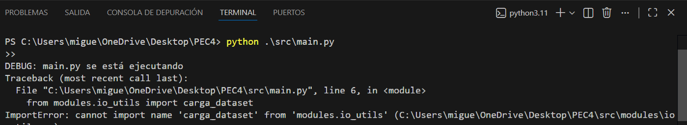

## Estructura del proyecto

El proyecto se organiza siguiendo los requerimientos de la PEC (modularidad, documentación,
tests/coverage, linting y capturas). La estructura de carpetas es la siguiente:

**- `data/`**  
  Contiene los datos proporcionados en el enunciado (si aplica). No se utilizan rutas absolutas.

**- `src/`**  
  Código fuente del proyecto. Incluye el punto de entrada `main.py` y los módulos/ejercicios.

**- `tests/`**  
  Suite(s) de tests para validar el funcionamiento del código y calcular el coverage.

**- `doc/`**  
  Documentación HTML generada automáticamente a partir de los docstrings del código.

**- `screenshots/`**  
  Capturas solicitadas en el enunciado: generación de documentación, ejecución de tests/coverage
  y ejecución del linter mostrando mi nombre como alumno.

  ## Ejercicio 1. Load dataset y EDA

Crear una función que acepte una ruta de archivo como argumento opcional. Si se proporciona la ruta, la función debe leer el fichero correspondiente. Si no se proporciona ninguna entrada, la función debe preguntar al usuario qué dataset de los dos disponibles desea cargar. Esta función se deberá reutilizar en los siguientes ejercicios.

## Incidencias durante el desarrollo

### Error de importación entre módulos

Durante la ejecución inicial del archivo `main.py` se produjo un error de importación
al intentar acceder a una función definida en un módulo auxiliar.

Concretamente, al ejecutar el script desde la raíz del proyecto, apareció el
siguiente error:

- `ImportError: cannot import name 'carga_dataset' from 'modules.io_utils'`

Este error se debía a un problema en la organización o definición de los módulos,
que impedía que Python localizara correctamente la función indicada en el momento
de la importación.

La incidencia se muestra en la siguiente captura de pantalla, tomada desde el
entorno de desarrollo (Visual Studio Code).

* Exploración del dataset. Para el dataset que el usuario seleccione, se debe:

    * 1.1. Mostrar las 5 primeras filas.
    * 1.2. Mostrar las columnas del dataframe.
    * 1.3. Mostrar la información (*info()*)

