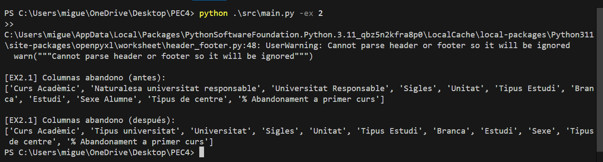

## Ejercicio 2: limpieza de los datos y filtrado
Se pretende hacer un análisis de los dos datasets que se proporcionan. Para ello, lo primero que queremos hacer es limpiar y unir los datasets. Como habrás podido comprobar en el EDA, los datasets tienen estructuras similares pero no completamente iguales. Los objetivos de este ejercicio son:

Homogeneizar ambos datasets: implica que las columnas tengan el mismo nombre y que los datos que se muestren tengan el mismo origen
Actualmente cada línea de datos muestra la información de un estudio en concreto por curso académico y sexo (para diferenciar los resultados entre hombres y mujeres). Para simplificar el análisis posterior, queremos agrupar los estudios por rama (Branca), de tal forma que tengamos una línea por curso académico y rama de estudio, donde la tasa de rendimiento y el % de abandono sea la media de los estudios que contienen esa rama.
Finalmente queremos crear un dataset fusionado a partir de ambos datasets

Para comenzar, creo una función para cargar los dos archivos.
Una vez cargados, compruebo las columnas de cada fichero 

**¿Qué columnas hay en los archivos?**

**En el archivo Rendimiento:**

1- Curs Acadèmic
2- Tipus universitat
2- Universitat
3- Sigles
4- Unitat
5- Tipus Estudi
6- Branca
7- Codi Estudi
8- Estudi
9- Sexe
10- Integrat S/N
11- Crèdits ordinaris superats
12- Crèdits ordinaris matriculats
13- Taxa rendiment

**En el archivo Abandono:**

1- Curs Acadèmic
2- Naturalesa universitat responsable, *esta entiendo que equivaldría a Tipus universitat* 
3- Universitat Responsable, *esta entiendo que equivaldría a Universitat*
4- Sigles
5- Unitat
6- Tipus Estudi
7- Branca
8- Estudi
9- Sexe Alumne, *esta entiendo que equivaldría a Sexe*
10- Tipus de centre
11- % Abandonament a primer curs 

### 2.1. Renombrar las columnas del dataset taxa_abandonament.xlsx para que coincida con el dataset rendiment_estudiants.xlsx

**Para hacerlo, creo un archivo en src\modules llamado clean.py:**

En este archivo creo una función para renombrar las columnas:

- Naturalesa universitat responsable por Tipus universitat
- Universitat Responsable por Universitat
- Sexe Alumne por Sexe

Para comprobar si funciona, en el archivo src\modules\main.py incluyo las instrucciones para cargar el ejercicio 2 y hago un print con las columnas del archivo abandono. Uso el terminal de VS y ejecuto:

## 2.2. Eliminar las columnas de "Universitat", "Unitat" en ambos dataframes, y también "Crèdits ordinaris superats" y "Crèdits ordinaris matriculats" en el caso del dataset de rendimiento.

Mientras desarrollaba el Ejercicio 2, me di cuenta de que el flujo de ejecución era un poco pesado. Cada vez que quería probar la limpieza de columnas, el programa me obligaba a pasar por el Ejercicio 1 y seleccionar manualmente el archivo de entrada.

El enunciado pide que main.py permita ejecutar ejercicios por separado, y mi implementación inicial no era lo suficientemente flexible. Por eso, ajusté la lógica del parámetro -ex.

¿El resultado? Ahora, si ejecuto -ex 2, el script va directo al grano, ignorando los pasos del primer ejercicio. Esto hace que el desarrollo y la corrección sea mucho más ágil. Abajo se puede ver cómo el Ejercicio 2 funciona ahora de forma aislada.

## 2.3. Crear y aplicar a los datasets una función que agrupe todas las filas que compartan las mismas características (excepto el nombre del estudio) para ambos datasets. La función debe devolver un nuevo dataset con:
    Una fila por cada combinación únicas de las columnas ['Curs Acadèmic', 'Tipus universitat', 'Sigles', 'Tipus Estudi', 'Branca', 'Sexe', 'Integrat S/N']
    Una columna con el rendimiento medio, en el caso del dataset de rendimiento y con la tasa media de abandono en el caso del dataset de abandono.

Para agrupar los datasets podéis utilizar el método _groupby_ de pandas, y para fusionar ambos datasets, el método _merge_ con la propiedad _inner_. 

Para que el análisis fuera manejable antes de fusionar los datasets, decidí crear una función de pre-agrupación. Usé groupby para obtener la media de las tasas de rendimiento y abandono.
Elegí la media porque, al trabajar con porcentajes, es la forma más justa de comparar grupos; así evito que un grupo con muchos más registros que otro acabe "pesando" más de la cuenta en la tendencia final.
Durante el desarrollo, estuve revisando cómo optimizar este paso consultando tanto la documentación de Pandas como la de PySpark (para entender mejor las lógicas de agregación de datos a mayor escala):

Documentación de Pandas:- https://pandas.pydata.org/docs/reference/api/pandas.DataFrame.groupby.html
Documentación de Apache Sparck:
https://spark.apache.org/docs/latest/api/python/reference/pyspark.sql/api/pyspark.sql.DataFrame.groupBy.html

## 2.4. Crear una función para fusionar ambos datasets. El dataset resultante solo debe contener las filas coincidentes entre ambos datasets. A partir de ahora utilizaréis este datasets en los ejercicios futuros. 

Para poder analizar todas las variables en conjunto, he creado una función que integra ambos datasets en uno solo. He optado por un inner join mediante el método merge de Pandas; de esta forma, me aseguro de que el DataFrame resultante solo contenga filas con información completa en ambos lados, evitando registros vacíos que ensuciarían los ejercicios siguientes.

Para ajustar correctamente los parámetros de la unión (especialmente las claves de cruce), me apoyé en estos recursos:

Documentación de Pandas:- https://pandas.pydata.org/docs/reference/api/pandas.DataFrame.merge.html
Guía de 4Geeks - https://4geeks.com/es/how-to/pandas-merge
