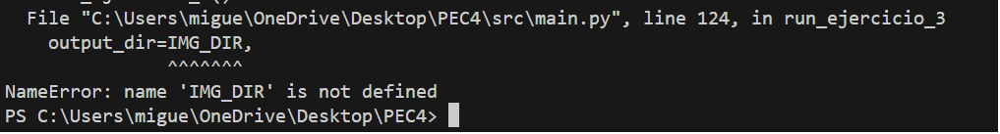
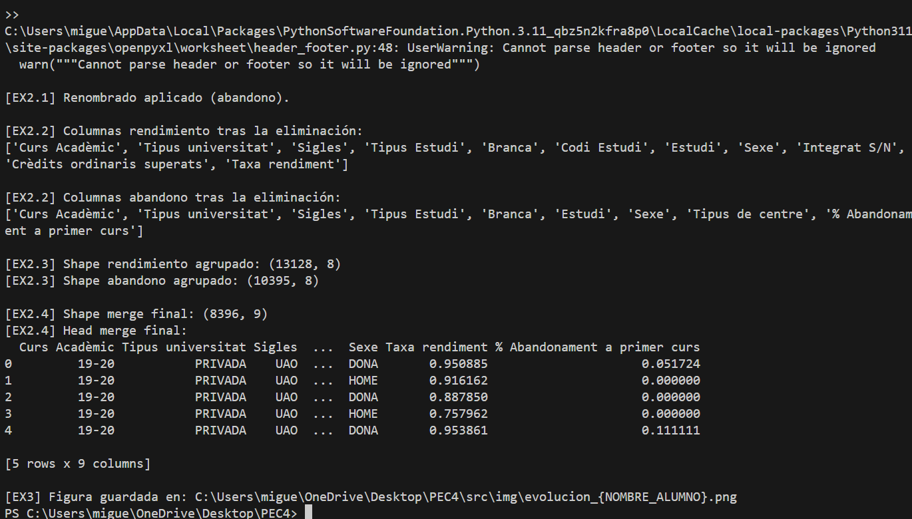
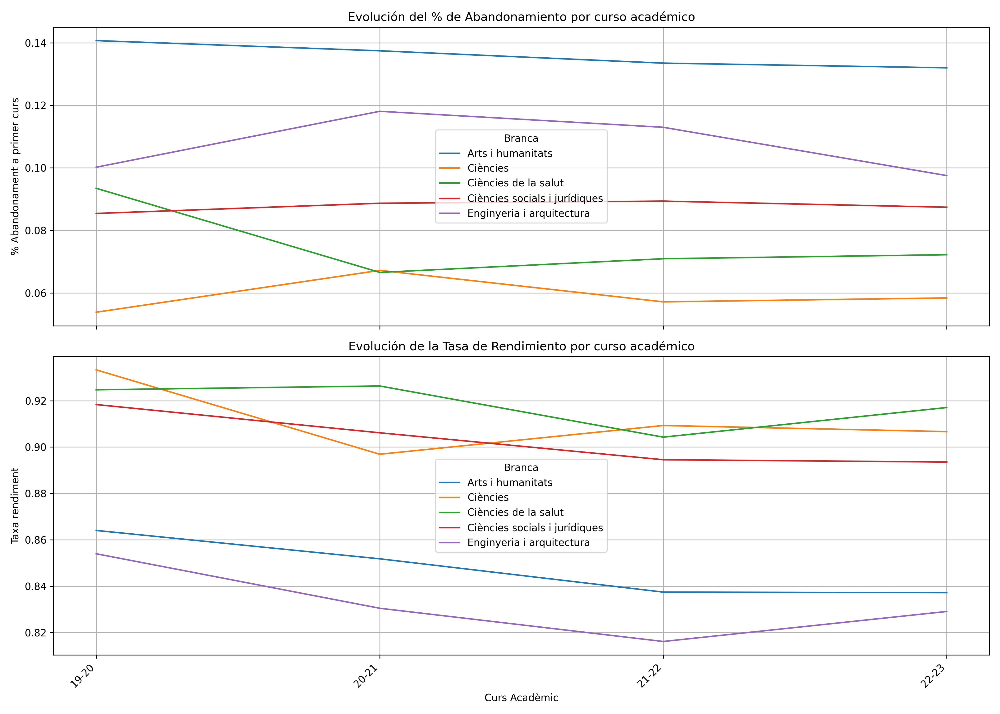

## Ejercicio 3: Análisis Visual de Tendencias Temporales

### 3.1. Generación de Gráficos de Series Temporales
Crear una función que genere visualizaciones de series temporales con las siguientes características:

Crear dos gráficos (subplots) en una misma figura:

Gráfico 1: Evolución del % de Abandonamiento por curso académico
Gráfico 2: Evolución de la Tasa de Rendimiento por curso académico
Cada gráfico debe mostrar:

Una línea diferente para cada rama de estudio (Branca)
Leyenda identificando cada rama
Grid para facilitar la lectura
Etiquetas de ejes apropiadas
Título descriptivo
Visualización:

Tamaño de figura recomendado: 14x10 pulgadas
Utilizar colores distintos para cada rama (sugerencia: plt.cm.tab10)
Rotar etiquetas del eje X si es necesario para mejor legibilidad

### Error

Durante las pruebas del Ejercicio 3, me encontré con un error al intentar exportar los gráficos de Matplotlib. El script fallaba porque la función no encontraba la ruta de guardado.

Al final era una tontería: estaba llamando a IMG_DIR sin haberla definido. Lo arreglé declarando todas las rutas arriba del main.py para que no vuelva a pasar.

Ejecuto de nuevo ejercicio 3 en la terminal:

Al ejecutar, observé que también se ejecutaba el Ejercicio 2, lo cual no es lo ideal si queremos que cada ejercicio sea autónomo.

Para solucionarlo, la idea es que el Ejercicio 3 cargue directamente el dataset ya fusionado del Ejercicio 2 (por ejemplo desde src/out/merged_ej2.csv) y no vuelva a recalcular todo el pipeline.

### Para la creación de los gráficos

Creo una función para los gráficos:

Primero creo copia de seguridad de dataset con df.copy () para no modificar el DF original y normalizo la columna Curs Acadèmic para asegurar la consistencia del eje X.
Para ordenar los cursos uso la función sort_key, así consigo que el gráfico siga un orden cronológico
Ahora configuro el lienzo del gráfico, defino el color de cada Branca sin complicaciones, usando la paleta que se ha sugerido.En cuanto al tamaño, uso también el sugerido (14x10). 
Para los subplots, creo una figura con dos filas y una columna, usando el parámetro sharex=True para que ambos gráficos puedan compartir el mismo eje X.
Para la estética del gráfico, inserto una leyenda con los nombres de las brancas y roto 45 grados las etiquetas del eje X.

**Gráfico**

#### Referencias

https://docs.python.org/es/dev/howto/sorting.html
