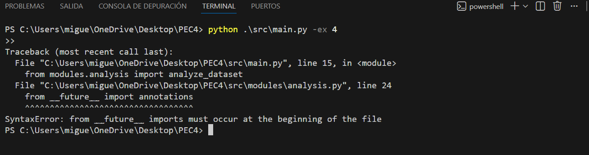

## Ejercicio 4: Análisis estadístico automatizado.

En este ejercicio, crearás una función llamada analyze_dataset() que se encargará de realizar un análisis estadístico completo del dataset fusionado que obtuviste en el ejercicio 2. El objetivo es calcular diferentes métricas y estadísticas que nos permitan entender mejor el comportamiento del rendimiento y el abandono universitario, y guardar todos estos resultados en un archivo JSON bien estructurado.

**Estructura del análisis JSON:**

El archivo JSON que debes generar (src/report/analisi_estadistic.json) debe contener los siguientes apartados. Observa cómo está organizado en secciones lógicas que van de lo general (metadata y estadísticas globales) a lo específico (análisis por rama). Podrás ver un ejemplo de la estructura en (examples/analisi_estadistic_example.json) (Nota: Los valores del ejemplo no son los correctos).

### 4.1. Sección Metadata:
Esta sección debe contener información básica sobre el análisis que estás realizando. Piensa en ella como la "ficha técnica" de tu análisis:

fecha_analisis: La fecha actual en formato ISO (YYYY-MM-DD). Usa datetime.now().strftime("%Y-%m-%d") para obtenerla automáticamente.
num_registros: El número total de registros en tu dataset fusionado. Simplemente usa len(merged_df).
periodo_temporal: Una lista ordenada con todos los cursos académicos únicos que aparecen en tus datos. Puedes obtenerla con sorted(merged_df['Curs Acadèmic'].unique()).

Para evitar el problema que tiene el módulo json que usa Python como estándar con los valores de NumPy o los valores nulos de Panda, voy a implementar una función de limpieza, transformando estos formatos en tipos nativos de Python y evitar así errores de compatibilidades.

**Función:**
def preparar_para_json(valor: Any) -> Any:
    """
    Convierte datos de NumPy/Pandas a tipos estándar de Python y
    así evitar errores al exportar a JSON.
    """
    if isinstance(valor, (np.integer,)):
        return int(valor)
    if isinstance(valor, (np.floating,)):
        return float(valor)
    if isinstance(valor, (np.ndarray,)):
        return valor.tolist()
    if pd.isna(valor):
        return None
    return valor

  **Ejecuto el ejercicio para ver si el apartado 4.1 está ok**

  

#### Referencias:

https://docs.python.org/3/library/json.html
