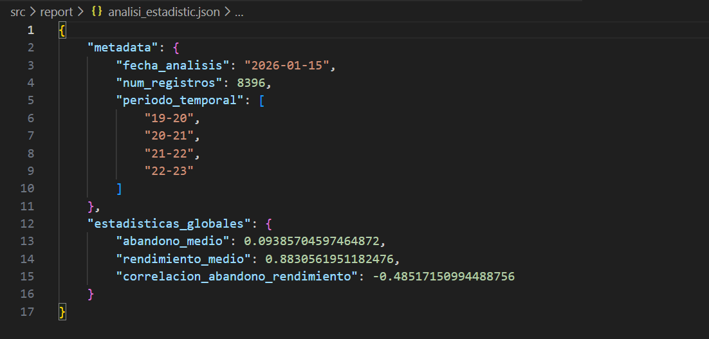
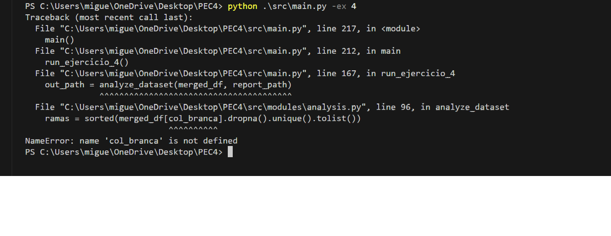
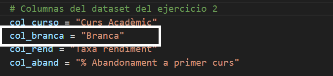
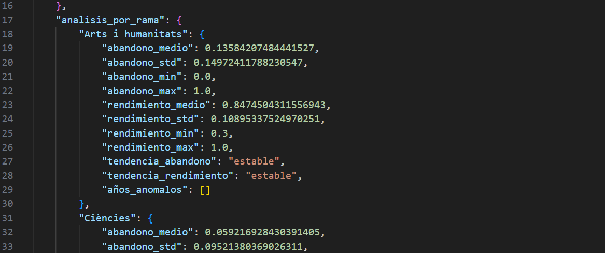

## Ejercicio 4: Análisis estadístico automatizado.

En este ejercicio, crearás una función llamada analyze_dataset() que se encargará de realizar un análisis estadístico completo del dataset fusionado que obtuviste en el ejercicio 2. El objetivo es calcular diferentes métricas y estadísticas que nos permitan entender mejor el comportamiento del rendimiento y el abandono universitario, y guardar todos estos resultados en un archivo JSON bien estructurado.

**Estructura del análisis JSON:**

El archivo JSON que debes generar (src/report/analisi_estadistic.json) debe contener los siguientes apartados. Observa cómo está organizado en secciones lógicas que van de lo general (metadata y estadísticas globales) a lo específico (análisis por rama). Podrás ver un ejemplo de la estructura en (examples/analisi_estadistic_example.json) (Nota: Los valores del ejemplo no son los correctos).

### 4.1. Sección Metadata:
Esta sección debe contener información básica sobre el análisis que estás realizando. Piensa en ella como la "ficha técnica" de tu análisis:

fecha_analisis: La fecha actual en formato ISO (YYYY-MM-DD). Usa datetime.now().strftime("%Y-%m-%d") para obtenerla automáticamente.
num_registros: El número total de registros en tu dataset fusionado. Simplemente usa len(merged_df).
periodo_temporal: Una lista ordenada con todos los cursos académicos únicos que aparecen en tus datos. Puedes obtenerla con sorted(merged_df['Curs Acadèmic'].unique()).

Para evitar el problema que tiene el módulo json que usa Python como estándar con los valores de NumPy o los valores nulos de Panda, voy a implementar una función de limpieza, transformando estos formatos en tipos nativos de Python y evitar así errores de compatibilidades.

**Función:**
def preparar_para_json(valor: Any) -> Any:
    """
    Convierte datos de NumPy/Pandas a tipos estándar de Python y
    así evitar errores al exportar a JSON.
    """
    if isinstance(valor, (np.integer,)):
        return int(valor)
    if isinstance(valor, (np.floating,)):
        return float(valor)
    if isinstance(valor, (np.ndarray,)):
        return valor.tolist()
    if pd.isna(valor):
        return None
    return valor

  **Ejecuto el ejercicio para ver si el apartado 4.1 está ok**

### 4.2. Estadísticas Globales:
Aquí calcularás las métricas que resumen el comportamiento general de todo el sistema universitario catalán, sin diferenciar por ramas:

abandono_medio: La tasa media de abandono en primer curso, calculada como la media de la columna '% Abandonament a primer curs'.
rendimiento_medio: La tasa media de rendimiento, calculada como la media de la columna 'Taxa rendiment'.
correlacion_abandono_rendimiento: Este es un valor muy interesante que nos indica si existe relación entre el abandono y el rendimiento. Para calcularlo, debes usar la correlación de Pearson de scipy:
from scipy.stats import pearsonr

corr, p_value = pearsonr(
    merged_df['% Abandonament a primer curs'].dropna(),
    merged_df['Taxa rendiment'].dropna()
)
Una correlación negativa (como -0.68) nos indica que a mayor abandono, menor rendimiento, lo cual tiene sentido intuitivo.

Para este apartado, añado a la función una limpieza de posibles valores nulos, para que las estadísticas no den errores o resultados incorrectos. Para ello uso la función dropna() de Pandas.
Para calcular las medias generales uso float(), así me aseguro que el resultado sea compatible con JSON. 
En cuanto a la correlación de Pearson, creo un DF temporal con ambas columnas y limpio las filas incompletas, porque tienen que estar en pareja para calcular la correlación.

**Comentario resultado correlación de Pearson**

Según el resultado de la correlación entre la tasa de rendimiento y el abandono ha sido -0.48, (por debajo del valor de 0.65). Siendo así, se confirma que, a medida que mejora el rendimiento de los estudiantes, el porcentaje de abandono en el primer curso tiende a disminuir. 

## 4.3. Análisis por Rama:
Esta es la sección más completa del análisis. Para cada rama de estudios (Arts i humanitats, Ciències, Ciències de la salut, etc.), debes calcular:

**Estadísticas descriptivas básicas:**

Media y desviación estándar del porcentaje de abandono
Media y desviación estándar de la tasa de rendimiento
Detección de tendencias temporales:

Aquí es donde aplicarás la regresión lineal para detectar si el abandono en cada rama está mejorando (tendencia decreciente), empeorando (tendencia creciente), o se mantiene estable en el tiempo.

**El proceso es el siguiente:**

**a) Primero, agrupa los datos por año académico para cada rama:**

branch_data = merged_df[merged_df['Branca'] == branch]
branch_by_year = branch_data.groupby('Curs Acadèmic').agg({
    '% Abandonament a primer curs': 'mean'
}).reset_index()
**b) Extrae las listas de años y valores:**

years = branch_by_year['Curs Acadèmic'].tolist()
valores_abandono = branch_by_year['% Abandonament a primer curs'].tolist()

**c) Calcula la regresión lineal usando scipy:**

from scipy.stats import linregress

slope, intercept, r_value, p_value, std_err = linregress(
    range(len(years)),  # Posiciones: 0, 1, 2, 3...
    valores_abandono
)
**d) Interpreta la pendiente (slope):**

Si slope > 0.01: la tendencia es "creciente" (el abandono aumenta con el tiempo)
Si slope < -0.01: la tendencia es "decreciente" (el abandono disminuye)
Si está entre -0.01 y 0.01: la tendencia es "estable" (sin cambios significativos)

Para este apartado del ejercicio, he bajado al detalle por cada rama (Branca) usando el archivo que fusioné en el Ejercicio 2. Lo que he hecho es:

Sacar los números típicos: El promedio, el máximo, el mínimo y cuánto varían el abandono y el rendimiento en cada rama.

Ver hacia dónde va la tendencia según venía explícitamente en el enunciado: Para saber si el abandono sube o baja con el tiempo, he aplicado una regresión lineal usando scipy, como se pedía.

Todo esto queda bien organizado en el JSON final dentro de analisis_por_rama. Despúés de varios intentos creo que he conseguido que quede como el JSON del ejemplo, no sin errores, que he tenido varios:

#### Error

El problema era que se estaba usando la variable col_branca sin haber sido definida previamente dentro de la función (o en el mismo bloque de código donde se utilizaba). Solución: incluyo la variable.

Ejecuto para ver la salida del JSON y parece que está correcto:

# 4.4. Rankings:

Para terminar el análisis, identifica qué ramas tienen los mejores y peores resultados. Esto es útil para tomar decisiones sobre dónde enfocar recursos o investigar qué están haciendo bien las ramas con mejores resultados:

Rama con mejor rendimiento (tasa más alta)
Rama con peor rendimiento (tasa más baja)
Rama con mayor abandono (porcentaje más alto)
Rama con menor abandono (porcentaje más bajo)
Puedes calcular los rankings ordenando las ramas según cada métrica y tomando el primer/último elemento.

#### Referencias:

https://docs.python.org/3/library/json.html
https://www.datacamp.com/es/tutorial/pandas

